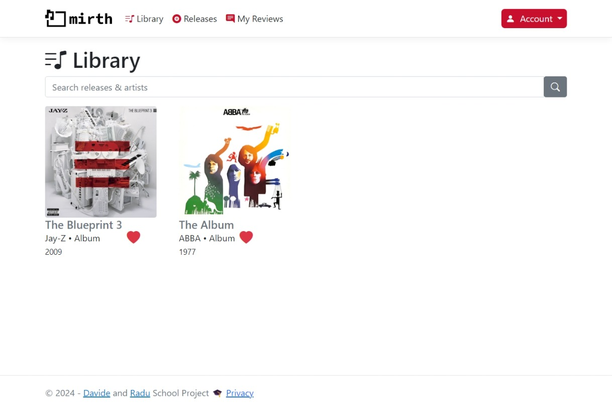
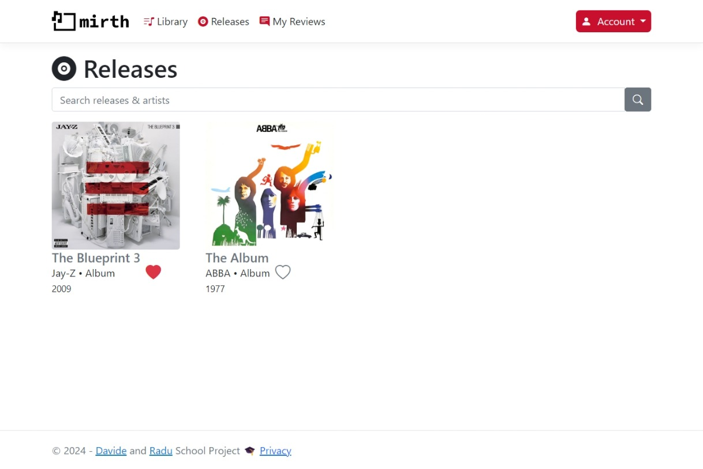
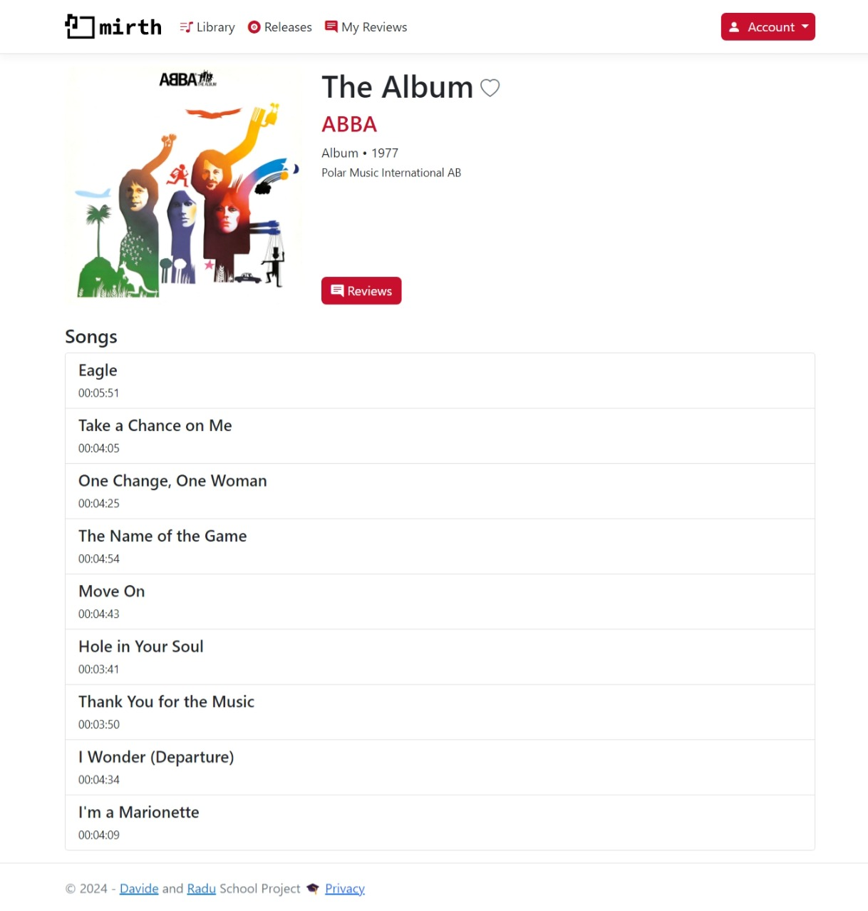
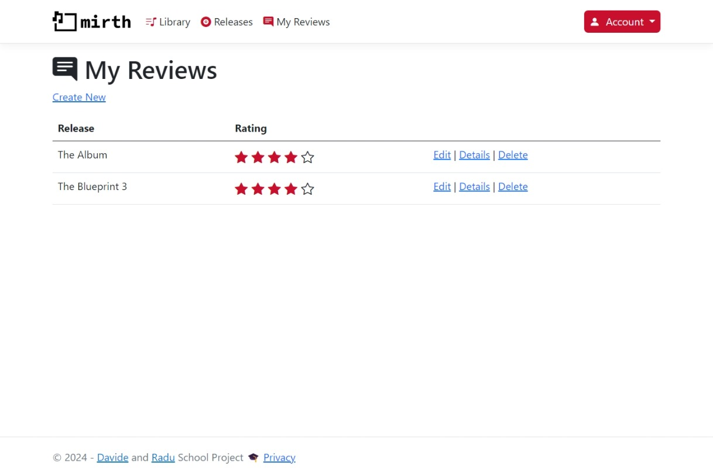
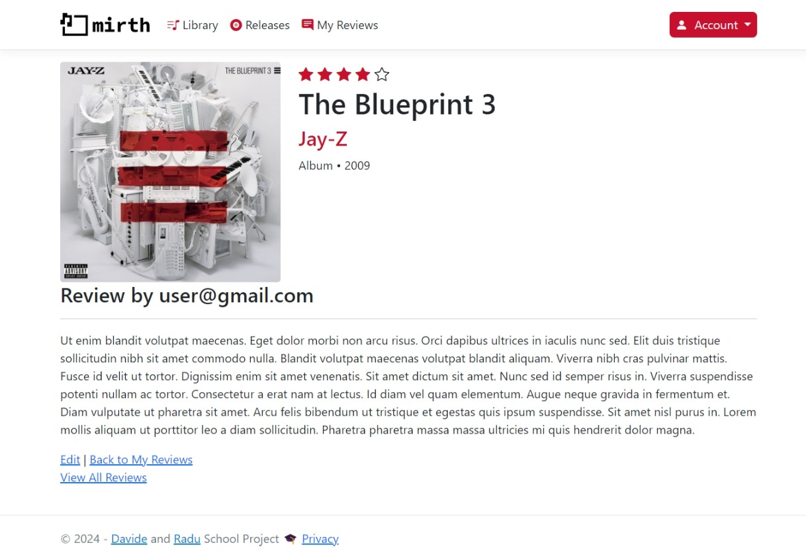

## Mirth - Music Library with Reviewing capabilities 🎵

### 🌐 Now online on Azure! - [Mirth](https://mirthweb.azurewebsites.net) 
🎓 This is a uni project for a class where we worked with ASP.NET Razor pages & .NET MAUI. This project is the implementation of the web app using ASP.NET Razor pages with an MS SQL Server database. My colleague [Davide](https://github.com/davidebara) implemented the mobile part of the application.

### Features 

##### Admin and User Roles

Admins:

- Manage Artists.
- Manage Releases (albums, EPs, singles).
- Create Genres.
- Manage Songs related to Releases.
- Moderate Reviews by users. 

Users:

- Save releases to their libraries.
- Go through the release catalog made available by admins.
- Rate & review records.

### Pictures

 User 

 

*User Library View*

*User Releases View*

*User Release View*

*User Reviews View*

*Individual User Review*

 Admin 

 

*Admin Interface Demonstration*

